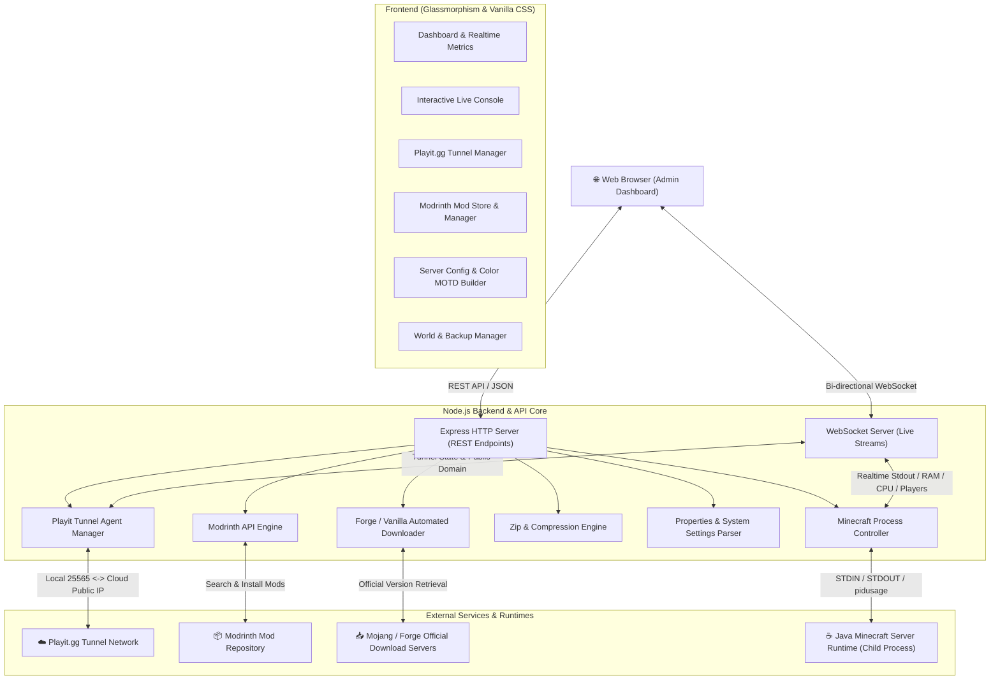
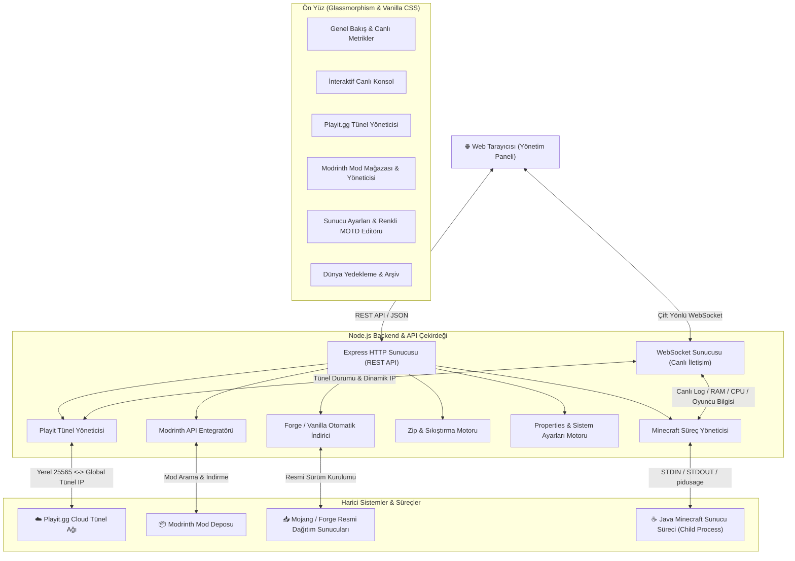

# 🌸 Sakura Minecraft Server & Web Management Panel

<p align="center">
  
</p>

<p align="center">
  <strong>Modern, Full-Featured Web Management Dashboard for Minecraft Forge & Vanilla Servers with Built-In Playit.gg Tunneling.</strong>
</p>

<p align="center">
  <a href="#english"><strong>🇬🇧 English</strong></a> •
  <a href="#türkçe"><strong>🇹🇷 Türkçe</strong></a>
</p>

<p align="center">
  
  
  
  
  
  
  
  
  
  
  
  
</p>

---

<a name="english"></a>
# 🇬🇧 English Documentation

## 📖 Overview
**Sakura Minecraft Server & Web Panel** is an all-in-one, zero-friction Minecraft server deployment and administration system. It bridges the gap between running local game servers and managing professional web hosting dashboards. With native **Playit.gg tunneling**, you do not need port forwarding or a static IP to play with your friends worldwide.

> **Lead Developer / Author:** Sami Kahraman  
> **License:** MIT  
> **Version:** v1.1.0  

---

## 🏗️ Architecture Diagram



---

## 🛠️ Technology Stack

| Component | Technology | Description |
| :--- | :--- | :--- |
| **Backend Runtime** |  | Asynchronous, non-blocking backend server |
| **Web Framework** |  | Fast, unopinionated REST API routing |
| **Realtime Stream** |  | Sub-millisecond bi-directional logs & metrics |
| **Tunneling** |  | Router-free global port tunneling |
| **Mod Ecosystem** |  | Official Modrinth REST API integration |
| **Process Monitoring**| `pidusage` | Real-time CPU & memory utilization tracking |
| **Game Runtime** |  | OpenJDK / Adoptium Hotspot JVM |
| **Game Engine** |  | Vanilla & Forge 1.7.10 - 1.21.x compatibility |

---

## ✨ Key Features

1. 🌐 **Zero Port-Forwarding (Playit.gg):**
   - Automatically detects system Playit agents or downloads a standalone client.
   - Dynamically extracts public tunnel domains (`*.ply.gg`, `*.joinmc.link`).
2. ⚡ **Interactive Live Console:**
   - Real-time Minecraft console logs with ANSI / Minecraft color code rendering.
   - Command history, autoscroll toggle, and instant command dispatching.
3. 🎨 **Interactive Color MOTD Builder:**
   - Full 16-color palette picker (`&0`–`&f`), bold (`&l`), italic (`&o`), and underline (`&n`).
   - Live Minecraft Multiplayer Server List card preview with signal bars and ping simulation.
4. 🧩 **1-Click Mod Manager:**
   - Search Forge mods via Modrinth without leaving the dashboard.
   - Enable, disable, or delete mod files with a single toggle.
5. 🛡️ **Fail-Safe Turnkey Design:**
   - Automatic EULA acceptance, memory overflow guards, and JVM flags optimization (Aikar's flags).

---

## 🚀 Quick Start Guide

### 1. Requirements
- **[Node.js](https://nodejs.org/)** (v18.0.0 or higher)
- **[Java JRE/JDK](https://adoptium.net/)** (Java 17 or 21)

### 2. Run the Panel
**On Windows:** Simply double-click `start_panel.bat`.  
*(It will install dependencies automatically on first run and launch the browser at `http://localhost:3000`).*

**Via Command Line:**
```bash
npm install
npm start
```

### 3. Deploy Your Server
1. Go to **"Version & Installer"** tab and pick **Forge** or **Vanilla**.
2. Click **"Start Installation"**.
3. Head to **"Dashboard"** and click **"Start Server"**!

---

## 👨‍💻 Author & License
- **Author:** Sami Kahraman
- **License:** [MIT License](LICENSE)

---
---

<a name="türkçe"></a>
# 🇹🇷 Türkçe Dokümantasyon

## 📖 Genel Bakış
**Sakura Minecraft Sunucu & Web Yönetim Paneli**, yerel bilgisayarınızda bir Minecraft sunucusu barındırmayı profesyonel bir web hosting paneli deneyimine dönüştüren modern bir yönetim arayüzüdür. Dahili **Playit.gg tünelleme sistemi** sayesinde modeminizden port açmaya (port forwarding) veya statik IP satın almaya gerek kalmadan tüm dünyadaki arkadaşlarınızla anında oynayabilirsiniz.

> **Baş Geliştirici / Yapımcı:** Sami Kahraman  
> **Lisans:** MIT  
> **Sürüm:** v1.1.0  

---

## 🏗️ Mimari Şema



---

## 🛠️ Kullanılan Teknolojiler & Kütüphaneler

| Bileşen | Teknoloji | Görevi ve Kullanım Amacı |
| :--- | :--- | :--- |
| **Backend Çekirdeği** |  | Asenkron, yüksek hızlı backend çalışma ortamı |
| **Web Sunucusu** |  | RESTful API yönlendirmeleri ve statik dosya sunumu |
| **Canlı İletişim** |  | Gecikmesiz canlı konsol akışı, anlık CPU/RAM takibi |
| **Portsuz Tünelleme** |  | Modem ayarı gerektirmeyen küresel bağlantı tüneli |
| **Mod Entegrasyonu** |  | Tek tıkla Forge modlarını arama ve indirme motoru |
| **Performans İzleme**| `pidusage` | Sunucu sürecinin CPU ve RAM tüketimini anlık ölçme |
| **Java Çalışma Ortamı**|  | Adoptium Hotspot / OpenJDK JVM çalıştırma altyapısı |
| **Oyun Altyapısı** |  | Vanilla & Forge 1.7.10 - 1.21.x sunucu desteği |

---

## ✨ Öne Çıkan Özellikler

1. 🌐 **Modem Portu Açmaya Son (Playit.gg):**
   - Bilgisayarda kurulu sistem Playit servisini otomatik algılar veya bağımsız istemciyi indirir.
   - Tünel adresini (`*.ply.gg`, `*.joinmc.link`) loglardan otomatik çekip arayüze yansıtır.
2. ⚡ **Gelişmiş Canlı Konsol:**
   - Minecraft renk kodlarını ve log seviyelerini (INFO, WARN, ERROR) renklendirerek sunar.
   - Komut geçmişi ve arayüzden tek tıkla Minecraft komutu gönderme.
3. 🎨 **İnteraktif Renkli MOTD Editörü:**
   - 16 resmi renk butonu (`&0` - `&f`), kalın (`&l`), italik (`&o`), altı çizili (`&n`) ve hazır şablonlar.
   - Minecraft "Çok Oyunculu" sunucu listesi kartı formatında birebir canlı önizleme.
4. 🧩 **Tek Tıkla Mod Yönetimi:**
   - Modrinth pazarından mod arama, tek tıkla indirme, mod açma/kapatma.
5. 🛡️ **Akıllı Kurulum Motoru:**
   - Otomatik EULA onayı, düşük RAM'li sistemler için optimize Aikar JVM bayrakları ve güvenli çalıştırma.

---

## 🚀 Hızlı Kullanım Kılavuzu

### 1. Gereksinimler
- **[Node.js](https://nodejs.org/)** (v18.0.0 veya üzeri)
- **[Java JRE/JDK](https://adoptium.net/)** (Minecraft sürümünüze göre Java 17 veya 21)

### 2. Paneli Başlatma
**Windows için:** Klasördeki **`start_panel.bat`** dosyasına çift tıklayın.  
*(İlk açılışta paketleri kurar ve tarayıcınızda `http://localhost:3000` adresini açar).*

**Terminal üzerinden:**
```bash
npm install
npm start
```

### 3. Sunucuyu Kurup Başlatma
1. Sol menüden **"Sürüm & Kurulum"** sekmesine gidin, **Forge** veya **Vanilla** seçip **"Kurulumu Başlat"** deyin.
2. Kurulum bitince **"Genel Bakış"** sekmesine gelip yeşil **"Sunucuyu Başlat"** butonuna basın.
3. Arkadaşlarınızla oynamak için **"Playit.gg Tünel"** sekmesinden IP adresinizi kopyalayın!

---

## 👨‍💻 Yapımcı & Lisans
- **Yapımcı:** Sami Kahraman
- **Lisans:** [MIT Lisansı](LICENSE)
